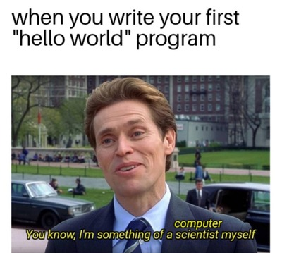

# Intro to Web Development

A repository to store all the course content files for **'Intro to Web Development'**. It includes files like class notes, assignments, labs, etc. for the course.

---

## Instructor

- Bernard Monette 

---

## What We Learn

In this class, Bernie teaches us about the web technologies that can be used to create a proper functioning website.[^1]



_A programming meme for HTML/CSS"_

> :memo: **Note:** This class is short and simple and focuses on the concepts of web development.

[^note]: This class takes place in the LB 126 room every Monday from 2:25 AM - 5:05 PM.

---

## Learning Resource
- [W3School HTML](https://www.w3schools.com/html/)
- [W3School CSS](https://www.w3schools.com/css/)

---

## Code Sample - HTML

```html
<!DOCTYPE html>
<html>
<head>
<title>Page Title</title>
</head>
<body>

<h1>This is a Heading</h1>
<p>This is a paragraph.</p>

</body>
</html>
```

## Code Sample - CSS

```css
body {
  background-color: lightblue;
}

h1 {
  color: white;
  text-align: center;
}

p {
  font-family: verdana;
  font-size: 20px;
}
```

- HTML history
- CSS
- Docker
- Github Pages
- Time management

[^1]: We have learned the above topics by now:
